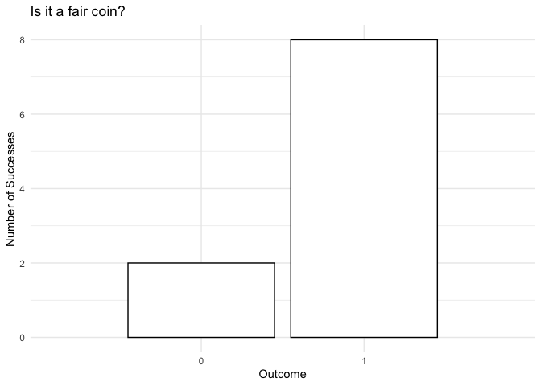
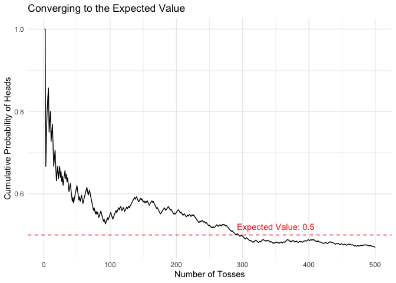
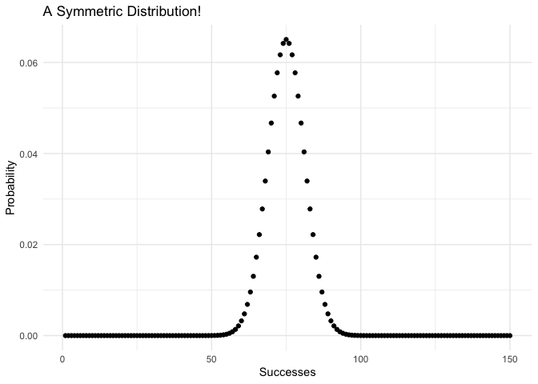
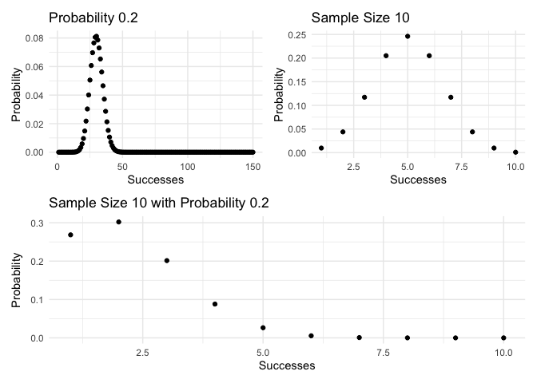
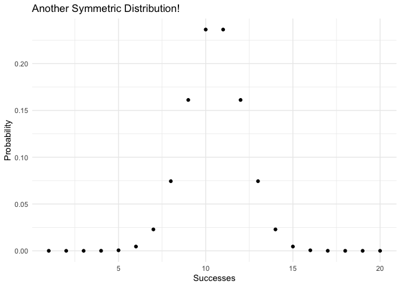
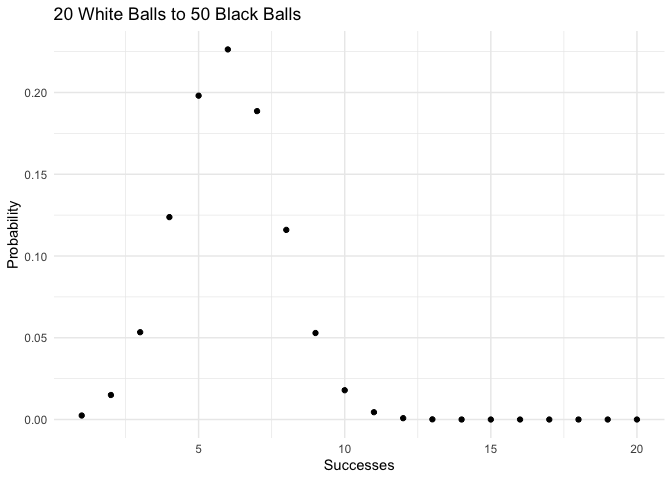

Probability Distributions
================

- <a href="#intro" id="toc-intro">Intro</a>
- <a href="#discrete-distributions"
  id="toc-discrete-distributions">Discrete Distributions</a>

### Intro

Recently, in the stats class that I’m taking, I’ve been exposed to
several foundational distributions. These distributions are of great
relevance to more advanced statistics concepts and so developing a
profound understanding of them seems like time well-spent.

In this notebook, I’ll take a look at the following distributions:

**Discrete**

1.  [Bernoulli](#bernoulli-distribution)
2.  [Binomial](#binomial-distribution)
3.  [Hyper-geometric](#hyper-geometric-distribution)
4.  Geometric
5.  Poisson

**Continuous**

1.  Uniform
2.  Normal
3.  Exponential

------------------------------------------------------------------------

### Discrete Distributions

Discrete distributions are those in which the elements composing the
distribution take on a **countable** number of elements. For all of the
following distributions, I will simply be focusing on the *probability
density function*.

#### Bernoulli Distribution

The Bernoulli distribution is characterized by only having two outcomes.
Assuming the two outcomes are $\{0, 1\}$, we typically assign $1$ a
probability of $p$ and assigning $0$ a probability of $1-p$. An
important note here is that the two events are **independent** of one
another (this will come back up when we generalize the distribution).

Most often, the probability distribution is associated with the tossing
of a coin, where we have two outcomes: heads or tails. Using this
example, we can arrive at the general form of the Bernoulli
distribution. If you want to know the probability that you get one toss
a specific amount of times in a row - let’s say 10 heads in a row, you
multiply the probability for each toss (hence the independence statement
before) and you reach the following:

$$ f(x) = (1-p)^{x-1}p $$ So if we want to know the probability that we
get ten heads in a row for a fair coin (50-50 chance to get either
side), we get the following:

$$f(10) = (1-0.5)^{9}0.5 = 0.000976 \ \text {or} \ \frac{1}{2^{10}}$$
Ok, now that we’ve written out the function, let’s go onto some R-code…

But, let’s first make some imports:

``` r
library("Rlab")
library(tidyverse)
library(ggplot2)
library(tidytuesdayR) # library from which we'll retrieve the data
library(patchwork)
library(stringr)
library(reshape2)
library(scales)
# Let's also set a theme for our plots
theme_set(theme_minimal())
```

Now, let’s go ahead and plot out some coin tosses, which is
representative our Bernoulli distribution:

``` r
# To maintain reproducibility we'll set a seed:
set.seed(42)

# list the number of samples:
num_samples <- 10

# Create a dataframe for the bernoulli:
bernoulli <- data.frame(
  toss = 1:num_samples,
  heads = rbern(n = num_samples, prob = 0.5)
)

# Convert to factor to plot:
factor <- as.factor(bernoulli$outcome)

# Plot a bar graph of the number of heads:
ggplot(mapping = aes(x=bernoulli$heads)) + 
  geom_bar(
    color = "black",
    fill = "white"
  ) + 
  labs(
    title = "Is it a fair coin?",
    x = "Outcome",
    y = "Number of Successes"
  ) + 
  scale_x_discrete(limits=c(0, 1))
```

    ## Warning: Continuous limits supplied to discrete scale.
    ## ℹ Did you mean `limits = factor(...)` or `scale_*_continuous()`?

<!-- -->

What gives? Shouldn’t we have the same number of head and tails if we
set the probability to 0.5? The reason we don’t is because of the
inherent randomness of the trial (nevertheless, the two outcomes still
technically do arrive at a $p$ and $1-p$ as expected).

Let’s take a quick tangent to quickly describe the *Weak Law of Large
Number*. This law basically states that as we increase our number of
samples, we will get closer to the expected value of the population.

In our case, as we toss more coins, we should expect that we come to a
50-50 split. Let’s demonstrate that using by plotting:

``` r
# To maintain reproducibility we'll set a seed:
set.seed(42)

# Set the number of samples to 500
num_samples <- 500

# Create a new dataframe with a counter and probability
bernoulli_large <- data.frame(
  toss = 1:num_samples,
  heads = rbern(n = num_samples, prob = 0.5)
) %>%
  mutate(
    heads_sum = cumsum(heads),
    heads_prob = heads_sum/toss
  )

# Plot out the successes:
ggplot(data = bernoulli_large) + 
  aes(x = toss, y = heads_prob) + 
  geom_line() + 
  geom_hline(yintercept = 0.5, color='red', linetype=2) + 
  annotate("text", x = 350, y = 0.52, color='red', label = "Expected Value: 0.5") + 
  labs(
    title = "Converging to the Expected Value",
    x = "Number of Tosses",
    y = "Cumulative Probability of Heads"
  )
```

<!-- -->

We can see that as we increase the number of tosses, we get closer and
closer to the expected value.

#### Binomial Distribution

The Binomial distribution is related closely to the Bernoulli
distribution. In fact, the Binomial distribution is really just a number
of independent Bernoulli trials. That said, we can write the
distribution fo the Binomial as follows:

$$ f(x) = \binom{n}{x}(1-p)^{1-x}p^x$$ where $n$ is the number of
trials, $x$ is the number of successes and $p$ is the probability of
success. Furthermore, the $\binom{n}{x}$ is the combination which is
calculated as:

$$ \binom{n}{x} = \frac{n!}{x!(n-x)!}$$ We use the combination here
since we don’t care about the order of the trials, we’re more focused on
the outcomes.

All that being said, let’s go ahead and do some plotting:

``` r
# To maintain reproducibility we'll set a seed:
set.seed(42)

# list the number of samples:
num_samples <- 150
probability <- 0.5

# Create a dataframe for the bernoulli:
binomial <- data.frame(
  samples = 1:num_samples,
  successes = dbinom(x = 1:num_samples, size = num_samples, prob = probability)
)

# Plot the observations:
ggplot(data = binomial) + 
  aes(x = samples, y = successes) +
  geom_point() + 
  labs(
    title = "A Symmetric Distribution!",
    x = "Successes",
    y = "Probability"
  )
```

<!-- -->

In this example, what we’re displaying is the probability that
$1 < x < 150$ for 150 observations, each with a probability of 0.5. Due
to the number of samples and the 50/50 probability, we achieve a nice,
normal curve. However, what if the probability is not 50/50 or if we
have much fewer trials?

Let’s investigate:

``` r
small_samples <- 10
skewed_probability <- 0.2

# Add the skewed probability to the previous dataframe:
binomial$successes_skewed = dbinom(
      x = 1:num_samples, 
      size = num_samples, 
      prob = skewed_probability)

# Create a new distribution for smaller number of samples:
binomial_small <- data.frame(
  samples = 1:small_samples,
  successes = dbinom(
    x = 1:small_samples, 
    size = small_samples, 
    prob = probability),
  successes_skewed = dbinom(
    x = 1:small_samples, 
    size = small_samples, 
    prob = skewed_probability)
)


# Plot the skewed distribution graph:
skewed <- ggplot(data = binomial) + 
  aes(x = samples, y = successes_skewed) +
  geom_point() + 
  labs(
    title = "Probability 0.2",
    x = "Successes",
    y = "Probability"
  )

# Plot the small samples graph
small_samples <- ggplot(data = binomial_small) + 
  aes(x = samples, y = successes) +
  geom_point() + 
  labs(
    title = "Sample Size 10",
    x = "Successes",
    y = "Probability"
  )

# Plot the skewed small graph
small_skewed_samples <- ggplot(data = binomial_small) + 
  aes(x = samples, y = successes_skewed) +
  geom_point() + 
  labs(
    title = "Sample Size 10 with Probability 0.2",
    x = "Successes",
    y = "Probability"
  )

(skewed | small_samples) / small_skewed_samples
```

<!-- -->

While with a skewed probability, we definitely observe the shift of the
distribution, we don’t see much of a difference with the reduced sample
size. Then we have the most chaotic scenario, we have a small sample
size with a skewed probability and we can see that this most definitely
does not follow a normal distribution.

#### Hyper-Geometric Distribution

Now, we’ve arrived at the hyper-geometric distribution, which is very
similar to the Binomial distribution. However, the key difference here
is that the probability of each trial changes with each successive
trial. An intuitive way of thinking about this is that we have sampling
that is done *without replacement* (whereas Bernoulli was done *with
replacement*).

We can write the hyper-geometric distribution function as such:

$$f(x) = \frac{\binom{X}{x}\binom{N-X}{n-x}}{\binom{N}{n}}$$ where $N$
is the size of the population, $X$ is the number of successes we’re
looking for in the population, $n$ is the number of draws, and $x$ is
the number of observed successes.

All that being said, let’s go ahead and create hyper-geometric
distribution:

``` r
# Set the arguments following the white/black ball urn example in documentation
num_white_balls_drawn <- 20
white_balls <- 20
black_balls <- 20
number_balls_drawn <- num_white_balls_drawn + 1

# Create a dataframe for the hyper-geometric:
hypergeo <- data.frame(
  samples = 1:num_white_balls_drawn,
  successes = dhyper(
    x = 1:num_white_balls_drawn,
    m = white_balls,
    n = black_balls,
    k = number_balls_drawn
  )
)

# Plot the observations:
ggplot(data = hypergeo) + 
  aes(x = samples, y = successes) +
  geom_point() + 
  labs(
    title = "Another Symmetric Distribution!",
    x = "Successes",
    y = "Probability"
  )
```

<!-- -->

Again, we see another normal distribution. At least that’s the case when
we have balanced classes. If we have unbalanced classes, we will begin
to see a more skewed distribution:

``` r
# Set the arguments following the white/black ball urn example in documentation
num_white_balls_drawn <- 20
white_balls <- 20
black_balls <- 50
number_balls_drawn <- num_white_balls_drawn + 1

# Create a dataframe for the hyper-geometric:
hypergeo_skewed <- data.frame(
  samples = 1:num_white_balls_drawn,
  successes = dhyper(
    x = 1:num_white_balls_drawn,
    m = white_balls,
    n = black_balls,
    k = number_balls_drawn
  )
)

# Plot the observations:
ggplot(data = hypergeo_skewed) + 
  aes(x = samples, y = successes) +
  geom_point() + 
  labs(
    title = "20 White Balls to 50 Black Balls",
    x = "Successes",
    y = "Probability"
  )
```

<!-- -->
