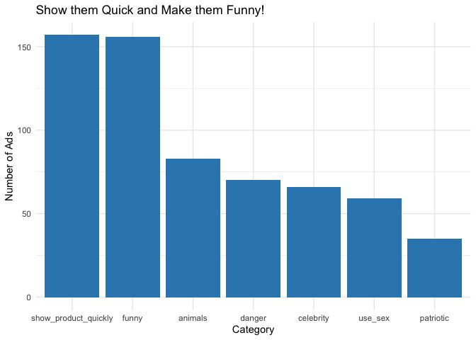
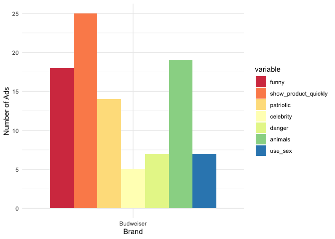
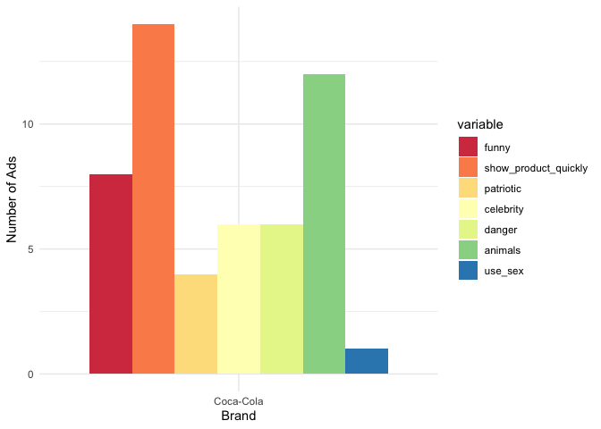
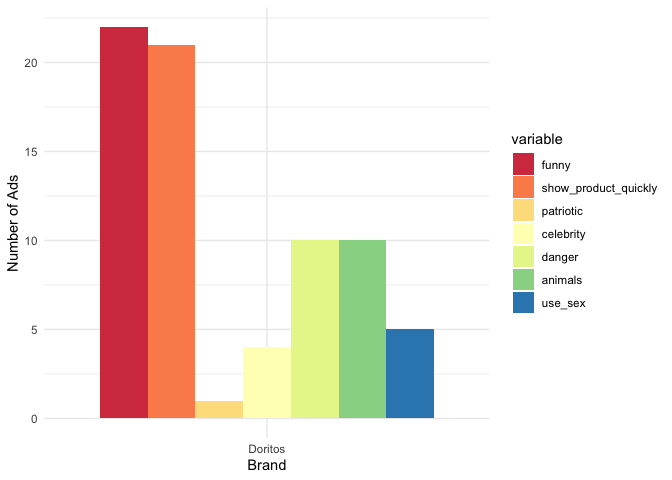
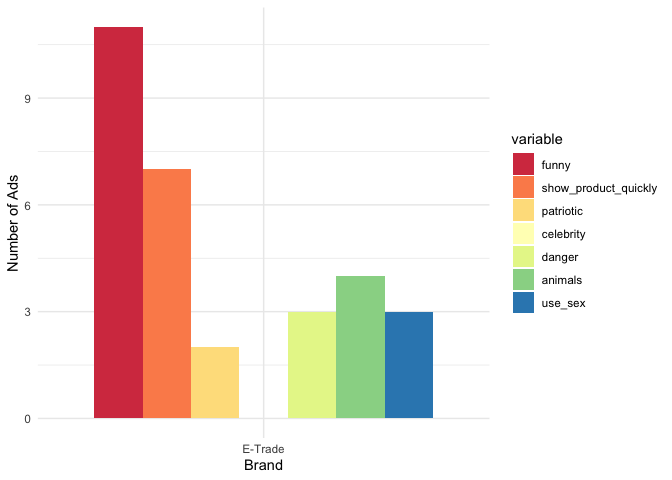
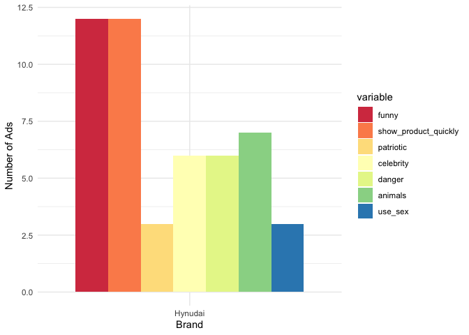
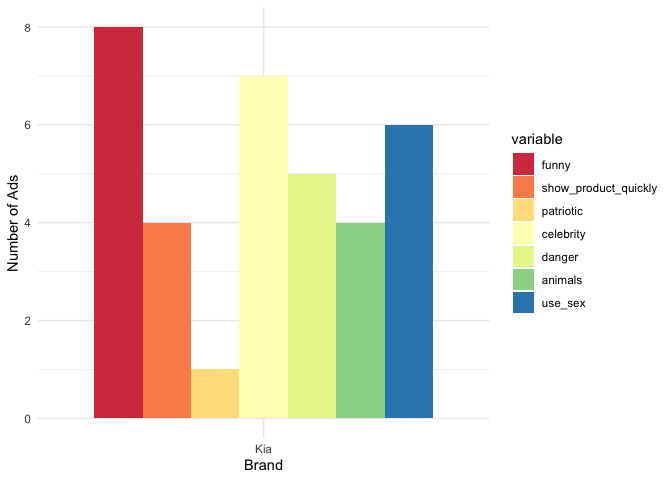
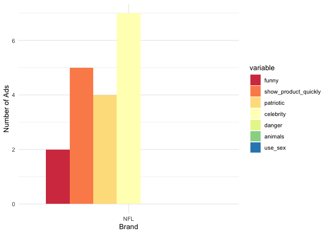
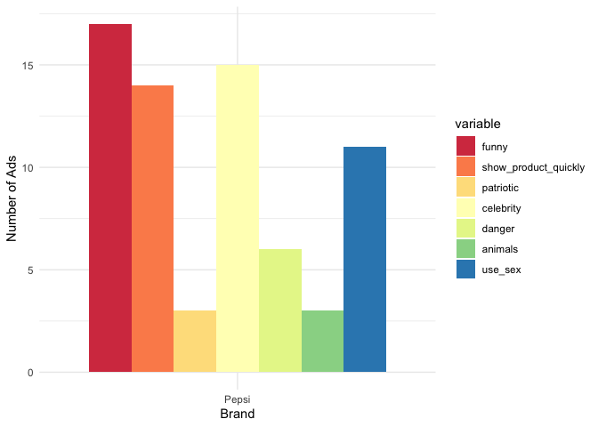
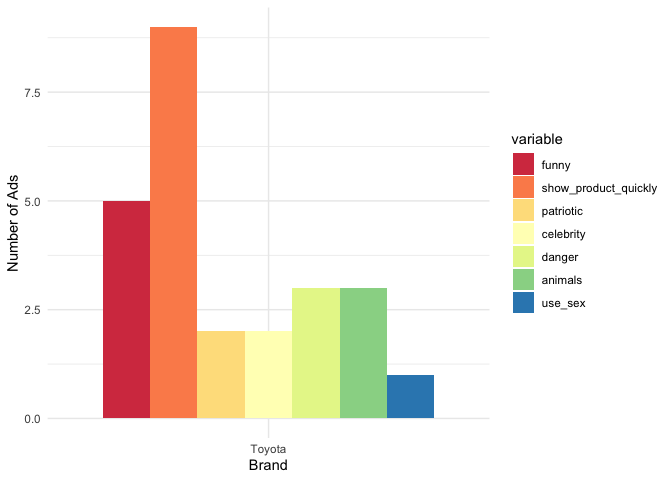

Super Bowl Ads
================

- <a href="#background" id="toc-background">Background</a>
- <a href="#setup" id="toc-setup">Setup</a>
- <a href="#exploratory-data-analysis-eda"
  id="toc-exploratory-data-analysis-eda">Exploratory Data Analysis
  (EDA)</a>

# Background

This notebook focuses on super bowl ads data! Again, this data is
retrieved from the `tidy-tuesday` collection.

To give a general overview, this dataset was curated by the team at
[FiveThirtyEight](https://fivethirtyeight.com/). Per their
[article](https://projects.fivethirtyeight.com/super-bowl-ads/) (which I
will refrain from reading to have a true explanatory experience), they
describe how they composed this dataset:

> We watched 233 ads from the 10 brands that aired the most spots in all
> 21 Super Bowls this century, according to superbowl-ads.com.1 While we
> watched, we evaluated ads using seven specific criteria, marking every
> spot as a “yes” or “no” for each.

For more information the dataset itself and the characteristics, feel
free to check it out
[here](https://github.com/rfordatascience/tidytuesday/blob/master/data/2021/2021-03-02/readme.md)

------------------------------------------------------------------------

# Setup

First, let’s load the libraries and data:

``` r
library(tidyverse)
library(ggplot2)
library(tidytuesdayR) # library from which we'll retrieve the data
library(patchwork)
library(stringr)
library(reshape2)

# Let's also set a theme for our plots
theme_set(theme_minimal())
```

Now let’s load the data from `tidy-tuesday` (March 2nd, 2021):

``` r
super_bowl_ads <- tt_load('2021-03-02')
```

    ## 
    ##  Downloading file 1 of 1: `youtube.csv`

``` r
super_bowl_ads <- super_bowl_ads$youtube
```

------------------------------------------------------------------------

# Exploratory Data Analysis (EDA)

To begin, I like to just take a quick gander at the data to see what it
looks like:

``` r
head(super_bowl_ads)
```

    ## # A tibble: 6 × 25
    ##    year brand     superbo…¹ youtu…² funny show_…³ patri…⁴ celeb…⁵ danger animals
    ##   <dbl> <chr>     <chr>     <chr>   <lgl> <lgl>   <lgl>   <lgl>   <lgl>  <lgl>  
    ## 1  2018 Toyota    https://… https:… FALSE FALSE   FALSE   FALSE   FALSE  FALSE  
    ## 2  2020 Bud Light https://… https:… TRUE  TRUE    FALSE   TRUE    TRUE   FALSE  
    ## 3  2006 Bud Light https://… https:… TRUE  FALSE   FALSE   FALSE   TRUE   TRUE   
    ## 4  2018 Hynudai   https://… https:… FALSE TRUE    FALSE   FALSE   FALSE  FALSE  
    ## 5  2003 Bud Light https://… https:… TRUE  TRUE    FALSE   FALSE   TRUE   TRUE   
    ## 6  2020 Toyota    https://… https:… TRUE  TRUE    FALSE   TRUE    TRUE   TRUE   
    ## # … with 15 more variables: use_sex <lgl>, id <chr>, kind <chr>, etag <chr>,
    ## #   view_count <dbl>, like_count <dbl>, dislike_count <dbl>,
    ## #   favorite_count <dbl>, comment_count <dbl>, published_at <dttm>,
    ## #   title <chr>, description <chr>, thumbnail <chr>, channel_title <chr>,
    ## #   category_id <dbl>, and abbreviated variable names
    ## #   ¹​superbowl_ads_dot_com_url, ²​youtube_url, ³​show_product_quickly,
    ## #   ⁴​patriotic, ⁵​celebrity

Immediately, there are a couple of columns I’d like to drop that really
won’t be useful for analysis. Those columns are:

- `superbowl_ads_dot_com_url`
- `youtube_url`
- `etag`
- `thumbnail`

I’m removing these columns since these columns are metadata that won’t
add any sort of value to our analyses.

``` r
super_bowl_ads <- subset(
  super_bowl_ads, 
  select = -c(superbowl_ads_dot_com_url,
              youtube_url,
              etag,
              thumbnail)
  )
```

Having removed those columns, let’s take a quick look to see if we have
any abnormalities like `NaN` values:

``` r
sapply(super_bowl_ads, function(x) sum(is.na(x)))
```

    ##                 year                brand                funny 
    ##                    0                    0                    0 
    ## show_product_quickly            patriotic            celebrity 
    ##                    0                    0                    0 
    ##               danger              animals              use_sex 
    ##                    0                    0                    0 
    ##                   id                 kind           view_count 
    ##                   11                   16                   16 
    ##           like_count        dislike_count       favorite_count 
    ##                   22                   22                   16 
    ##        comment_count         published_at                title 
    ##                   25                   16                   16 
    ##          description        channel_title          category_id 
    ##                   40                   16                   16

We find that there are several missing values in the `kind` and
`view_count` which will make analyzing those rows impossible. So let’s
look at those rows and make sure that we can drop them.

``` r
# Show the number of rows in the dataframe
print(nrow(super_bowl_ads))
```

    ## [1] 247

``` r
# Let's just drop the columns which have either missing views, and like_counts
# since those are the most important from an analysis point of views
super_bowl_ads <- super_bowl_ads[!is.na(super_bowl_ads$view_count), ]
super_bowl_ads <- super_bowl_ads[!is.na(super_bowl_ads$like_count), ]

# Let's view the missing values again:
sapply(super_bowl_ads, function(x) sum(is.na(x)))
```

    ##                 year                brand                funny 
    ##                    0                    0                    0 
    ## show_product_quickly            patriotic            celebrity 
    ##                    0                    0                    0 
    ##               danger              animals              use_sex 
    ##                    0                    0                    0 
    ##                   id                 kind           view_count 
    ##                    0                    0                    0 
    ##           like_count        dislike_count       favorite_count 
    ##                    0                    0                    0 
    ##        comment_count         published_at                title 
    ##                    6                    0                    0 
    ##          description        channel_title          category_id 
    ##                   22                    0                    0

``` r
print(nrow(super_bowl_ads))
```

    ## [1] 225

In total, we dropped about **22 observations**, which is not too many
considering we started with 247 observations (less than 10%).

With our data relatively clean (for analysis), let’s formulate a list of
questions we can answer regarding this dataset:

1.  Are certain types of commercials associated with a specific type of
    brand? Are they consistent their type of commercial or does it
    change over time?
2.  What are the most popular commercials? We can determine this by the
    number of views that a video received and furthermore, we can do
    some feature
3.  Does having more categories help or hurt a commercial? Tying in with
    question 2, do the most popular commercials typically have two or
    more categories? Or are they more focused on one single category?
    engineering to determine which ads have been wildly popular,
    controversial, etc.
4.  How well does youtube’s categorization match that of the
    FiveThirtyEight team?

Within each question, we will likely have further sub-questions, but for
now, let’s get started 🏃🏽‍♂️!

------------------------------------------------------------------------

### 1. Ad categories over time

The categories that we’re working with are:

- `funny`
- `show_product_quickly`
- `patriotic`
- `celebrity`
- `danger`
- `animals`
- `use_sex`

Some of these are more subjective than others (`funny`,
`show_product_quickly`), but we’ll trust the team at FiveThirtyEight has
a good sense of humor and is relatively impatient 😉.

First, let’s look at who our 10 brands are

``` r
unique(super_bowl_ads$brand)
```

    ##  [1] "Toyota"    "Bud Light" "Hynudai"   "Coca-Cola" "Kia"       "Budweiser"
    ##  [7] "NFL"       "Pepsi"     "Doritos"   "E-Trade"

We have:

- 3 car brands
- 5 food/beverage brands
- 1 financial brand
- 1 sports brand

Before looking at the ad categories, how is the distribution of ads
amongst the brands?

``` r
super_bowl_ads %>%
  group_by(brand) %>%
  summarize(total_ads = n()) %>%
  arrange(desc(total_ads))
```

    ## # A tibble: 10 × 2
    ##    brand     total_ads
    ##    <chr>         <int>
    ##  1 Bud Light        56
    ##  2 Budweiser        37
    ##  3 Pepsi            24
    ##  4 Doritos          23
    ##  5 Hynudai          22
    ##  6 Coca-Cola        20
    ##  7 E-Trade          12
    ##  8 Kia              12
    ##  9 Toyota           10
    ## 10 NFL               9

We can already see that the number of ads are heavily skewed towards our
food/beverage brands. So when we look at the categories of each of the
different ads, we should consider some sort of percentage to combat the
disparity in the number of ads between each brand.

Let’s go ahead and now create this grouping for our different
categories:

``` r
# Group the columns by each category
group_category_by_brand <- super_bowl_ads %>%
  group_by(brand) %>%
  summarize(
    funny = sum(funny),
    show_product_quickly = sum(show_product_quickly),
    patriotic = sum(patriotic), 
    celebrity = sum(celebrity),
    danger = sum(danger),
    animals = sum(animals),
    use_sex = sum(use_sex))

# Convert tible to dataframe
group_category_by_brand <- as.data.frame(group_category_by_brand)

group_category_by_brand
```

    ##        brand funny show_product_quickly patriotic celebrity danger animals
    ## 1  Bud Light    53                   46         1        14     24      21
    ## 2  Budweiser    18                   25        14         5      7      19
    ## 3  Coca-Cola     8                   14         4         6      6      12
    ## 4    Doritos    22                   21         1         4     10      10
    ## 5    E-Trade    11                    7         2         0      3       4
    ## 6    Hynudai    12                   12         3         6      6       7
    ## 7        Kia     8                    4         1         7      5       4
    ## 8        NFL     2                    5         4         7      0       0
    ## 9      Pepsi    17                   14         3        15      6       3
    ## 10    Toyota     5                    9         2         2      3       3
    ##    use_sex
    ## 1       22
    ## 2        7
    ## 3        1
    ## 4        5
    ## 5        3
    ## 6        3
    ## 7        6
    ## 8        0
    ## 9       11
    ## 10       1

Having generated this table, let’s make a useful visualization out of it
to extract greater meaning from it. However, to make said visualization,
we’ll need to use the `melt` function from `reshape2` to make it usable:

``` r
# Melt all the values from the dataframe to create a new one
melt_df <- melt(group_category_by_brand, id.vars = 1)

# Generate a grouped barplot
ggplot(
  data = melt_df,
  aes(x = value, y = reorder(brand, +value))) + 
  geom_bar(
    aes(fill = variable),
    stat = "identity",
    position = "stack") + 
  scale_fill_brewer(palette="Spectral") + 
  labs(
    title = "Funny Bud Light Ads are in Abundance!",
    x = "Number of Ads",
    y = "Brand"
  )
```

<!-- -->

This is quite a nice and informative graph. We can see that the majority
of the ads are Bud Light ones and that they always tend to be funny and
show their product quickly. Already from this graph, we can see that the
majority of the ads are funny ones, but let’s look at the distribution
of ads across the different groupings:

``` r
# Get the sums of each column
sum_df <- as.data.frame(
  as.list(
    colSums(Filter(is.numeric, group_category_by_brand))
  )
)

# Transpose the dataframe and make the index a new row called category
sum_df <- t(sum_df)
sum_df <- as.data.frame(cbind(category = rownames(sum_df), sum_df))
colnames(sum_df)[2] ="count"
sum_df$count = as.numeric(sum_df$count)

# Create the bar plot
sum_df %>%
  ggplot() + 
  aes(x = reorder(category, -count), y = count) + 
  geom_bar(
    stat = "identity",
    color = 'gray',
    fill = 'white') + 
  labs(
    title = "Show them Quick and Make them Funny!",
    x = "Category",
    y = "Number of Ads"
  )
```

<!-- -->

Ads which are funny and show the product quickly are the most prominent
types of ads amongst the biggest brands! From a general perspective,
that is how super bowl ads are typically thought of.

However, while those are all nice sets of graphs, we still don’t have a
definitive answer to what types of ads do companies use. Let’s answer
that with certainty now:

``` r
# Set up plotting space
brand_names <- as.list(group_category_by_brand$brand)

for (i in brand_names) { # Loop over loop.vector
  
  # Subset the dataframe
  df_subset <- melt_df[melt_df$brand == i, ]

  # store data in column.i as x
  plot <- df_subset %>%
    ggplot() + 
    aes(x = reorder(brand, +value), y = value) + 
    geom_bar(
      aes(fill = variable),
      stat = "identity",
      position = "dodge"
    ) + 
    scale_fill_brewer(palette="Spectral") + 
    labs(
      x = "Brand",
      y = "Number of Ads"
    )
  print(plot)
}
```

<!-- --><!-- --><!-- --><!-- --><!-- --><!-- --><!-- --><!-- --><!-- --><!-- -->
