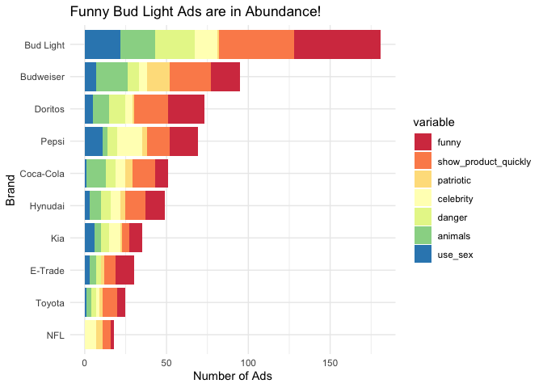
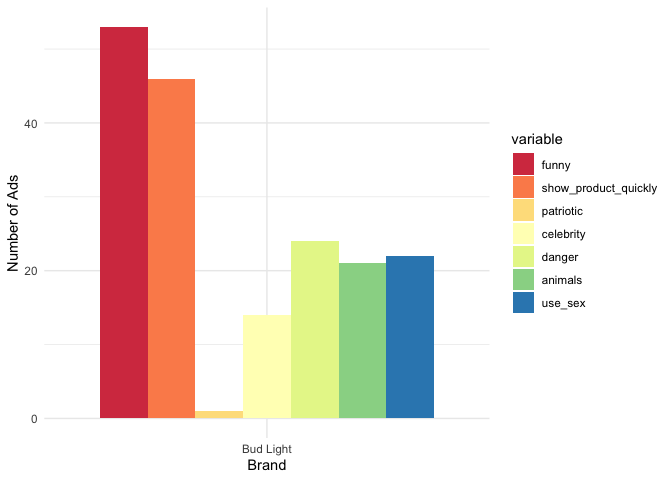
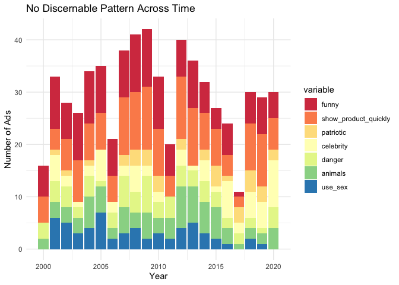
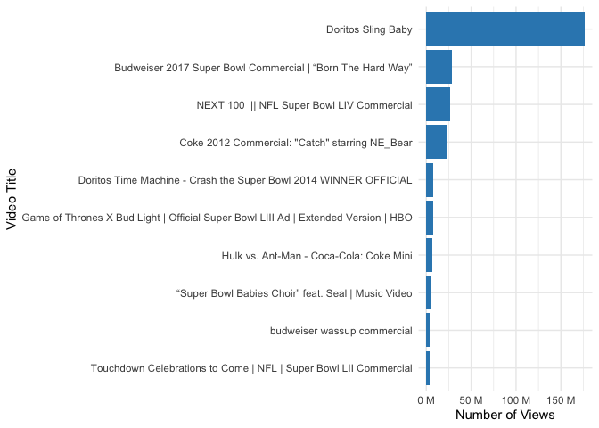
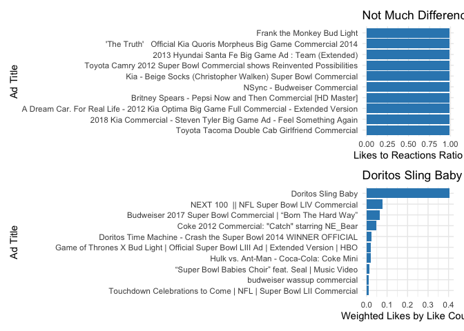
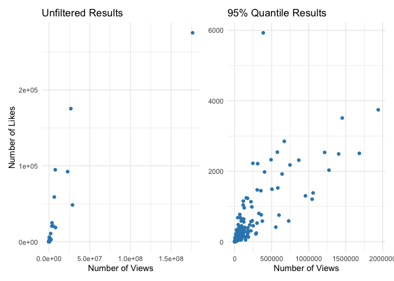
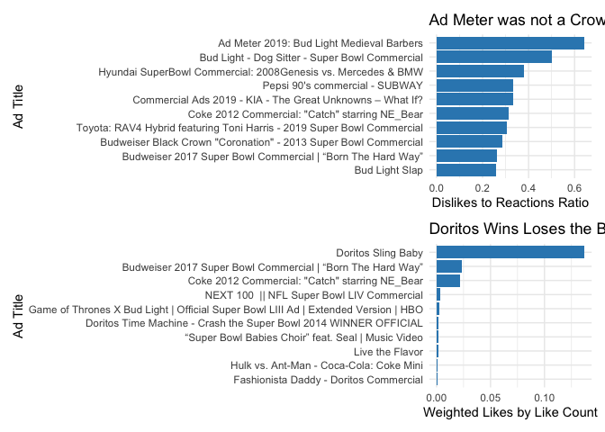

Super Bowl Ads
================

- <a href="#background" id="toc-background">Background</a>
- <a href="#setup" id="toc-setup">Setup</a>
- <a href="#exploratory-data-analysis-eda"
  id="toc-exploratory-data-analysis-eda">Exploratory Data Analysis
  (EDA)</a>
- <a href="#ad-categories-over-time" id="toc-ad-categories-over-time">Ad
  categories over time</a>
- <a href="#2--ad-superlatives" id="toc-2--ad-superlatives">2 | Ad
  Superlatives</a>
- <a href="#3--categories-and-views" id="toc-3--categories-and-views">3 |
  Categories and Views</a>

## Background

This notebook focuses on super bowl ads data! Again, this data is
retrieved from the `tidy-tuesday` collection.

To give a general overview, this dataset was curated by the team at
[FiveThirtyEight](https://fivethirtyeight.com/). Per their
[article](https://projects.fivethirtyeight.com/super-bowl-ads/) (which I
will refrain from reading to have a true explanatory experience), they
describe how they composed this dataset:

> We watched 233 ads from the 10 brands that aired the most spots in all
> 21 Super Bowls this century, according to superbowl-ads.com.1 While we
> watched, we evaluated ads using seven specific criteria, marking every
> spot as a “yes” or “no” for each.

For more information the dataset itself and the characteristics, feel
free to check it out
[here](https://github.com/rfordatascience/tidytuesday/blob/master/data/2021/2021-03-02/readme.md)

------------------------------------------------------------------------

## Setup

First, let’s load the libraries and data:

``` r
library(tidyverse)
library(ggplot2)
library(tidytuesdayR) # library from which we'll retrieve the data
library(patchwork)
library(stringr)
library(reshape2)
library(scales)
# Let's also set a theme for our plots
theme_set(theme_minimal())
```

Now let’s load the data from `tidy-tuesday` (March 2nd, 2021):

``` r
super_bowl_ads <- tt_load('2021-03-02')
```

    ## 
    ##  Downloading file 1 of 1: `youtube.csv`

``` r
super_bowl_ads <- super_bowl_ads$youtube
```

------------------------------------------------------------------------

## Exploratory Data Analysis (EDA)

To begin, I like to just take a quick gander at the data to see what it
looks like:

``` r
head(super_bowl_ads)
```

    ## # A tibble: 6 × 25
    ##    year brand     superbo…¹ youtu…² funny show_…³ patri…⁴ celeb…⁵ danger animals
    ##   <dbl> <chr>     <chr>     <chr>   <lgl> <lgl>   <lgl>   <lgl>   <lgl>  <lgl>  
    ## 1  2018 Toyota    https://… https:… FALSE FALSE   FALSE   FALSE   FALSE  FALSE  
    ## 2  2020 Bud Light https://… https:… TRUE  TRUE    FALSE   TRUE    TRUE   FALSE  
    ## 3  2006 Bud Light https://… https:… TRUE  FALSE   FALSE   FALSE   TRUE   TRUE   
    ## 4  2018 Hynudai   https://… https:… FALSE TRUE    FALSE   FALSE   FALSE  FALSE  
    ## 5  2003 Bud Light https://… https:… TRUE  TRUE    FALSE   FALSE   TRUE   TRUE   
    ## 6  2020 Toyota    https://… https:… TRUE  TRUE    FALSE   TRUE    TRUE   TRUE   
    ## # … with 15 more variables: use_sex <lgl>, id <chr>, kind <chr>, etag <chr>,
    ## #   view_count <dbl>, like_count <dbl>, dislike_count <dbl>,
    ## #   favorite_count <dbl>, comment_count <dbl>, published_at <dttm>,
    ## #   title <chr>, description <chr>, thumbnail <chr>, channel_title <chr>,
    ## #   category_id <dbl>, and abbreviated variable names
    ## #   ¹​superbowl_ads_dot_com_url, ²​youtube_url, ³​show_product_quickly,
    ## #   ⁴​patriotic, ⁵​celebrity

Immediately, there are a couple of columns I’d like to drop that really
won’t be useful for analysis. Those columns are:

- `superbowl_ads_dot_com_url`
- `youtube_url`
- `etag`
- `thumbnail`

I’m removing these columns since these columns are metadata that won’t
add any sort of value to our analyses.

``` r
super_bowl_ads <- subset(
  super_bowl_ads, 
  select = -c(superbowl_ads_dot_com_url,
              youtube_url,
              etag,
              thumbnail)
  )
```

Having removed those columns, let’s take a quick look to see if we have
any abnormalities like `NaN` values:

``` r
sapply(super_bowl_ads, function(x) sum(is.na(x)))
```

    ##                 year                brand                funny 
    ##                    0                    0                    0 
    ## show_product_quickly            patriotic            celebrity 
    ##                    0                    0                    0 
    ##               danger              animals              use_sex 
    ##                    0                    0                    0 
    ##                   id                 kind           view_count 
    ##                   11                   16                   16 
    ##           like_count        dislike_count       favorite_count 
    ##                   22                   22                   16 
    ##        comment_count         published_at                title 
    ##                   25                   16                   16 
    ##          description        channel_title          category_id 
    ##                   40                   16                   16

We find that there are several missing values in the `kind` and
`view_count` which will make analyzing those rows impossible. So let’s
look at those rows and make sure that we can drop them.

``` r
# Show the number of rows in the dataframe
print(nrow(super_bowl_ads))
```

    ## [1] 247

``` r
# Let's just drop the columns which have either missing views, and like_counts
# since those are the most important from an analysis point of views
super_bowl_ads <- super_bowl_ads[!is.na(super_bowl_ads$view_count), ]
super_bowl_ads <- super_bowl_ads[!is.na(super_bowl_ads$like_count), ]

# Let's view the missing values again:
sapply(super_bowl_ads, function(x) sum(is.na(x)))
```

    ##                 year                brand                funny 
    ##                    0                    0                    0 
    ## show_product_quickly            patriotic            celebrity 
    ##                    0                    0                    0 
    ##               danger              animals              use_sex 
    ##                    0                    0                    0 
    ##                   id                 kind           view_count 
    ##                    0                    0                    0 
    ##           like_count        dislike_count       favorite_count 
    ##                    0                    0                    0 
    ##        comment_count         published_at                title 
    ##                    6                    0                    0 
    ##          description        channel_title          category_id 
    ##                   22                    0                    0

``` r
print(nrow(super_bowl_ads))
```

    ## [1] 225

In total, we dropped about **22 observations**, which is not too many
considering we started with 247 observations (less than 10%).

With our data relatively clean (for analysis), let’s formulate a list of
questions we can answer regarding this dataset:

1.  Are certain types of commercials associated with a specific type of
    brand? How has the type of commercials changed over time?
2.  What are the most popular commercials? We can determine this by the
    number of views that a video received and furthermore, we can do
    some feature engineering to further define other sorts of
    superlatives (most controversial, likeable, etc.)
3.  Does having more categories help or hurt a commercial? Tying in with
    question 2, do the most popular commercials typically have two or
    more categories? Or are they more focused on one single category?
4.  How well does youtube’s categorization match that of the
    FiveThirtyEight team?

Within each question, we will likely have further sub-questions, but for
now, let’s get started 🏃🏽‍♂️!

------------------------------------------------------------------------

## Ad categories over time

The categories that we’re working with are:

- `funny`
- `show_product_quickly`
- `patriotic`
- `celebrity`
- `danger`
- `animals`
- `use_sex`

Some of these are more subjective than others (`funny`,
`show_product_quickly`), but we’ll trust the team at FiveThirtyEight has
a good sense of humor and is relatively impatient 😉.

First, let’s look at who our 10 brands are

``` r
unique(super_bowl_ads$brand)
```

    ##  [1] "Toyota"    "Bud Light" "Hynudai"   "Coca-Cola" "Kia"       "Budweiser"
    ##  [7] "NFL"       "Pepsi"     "Doritos"   "E-Trade"

We have:

- 3 car brands
- 5 food/beverage brands
- 1 financial brand
- 1 sports brand

Before looking at the ad categories, how is the distribution of ads
amongst the brands?

``` r
super_bowl_ads %>%
  group_by(brand) %>%
  summarize(total_ads = n()) %>%
  arrange(desc(total_ads))
```

    ## # A tibble: 10 × 2
    ##    brand     total_ads
    ##    <chr>         <int>
    ##  1 Bud Light        56
    ##  2 Budweiser        37
    ##  3 Pepsi            24
    ##  4 Doritos          23
    ##  5 Hynudai          22
    ##  6 Coca-Cola        20
    ##  7 E-Trade          12
    ##  8 Kia              12
    ##  9 Toyota           10
    ## 10 NFL               9

We can already see that the number of ads are heavily skewed towards our
food/beverage brands. So when we look at the categories of each of the
different ads, we should consider some sort of percentage to combat the
disparity in the number of ads between each brand.

Let’s go ahead and now create this grouping for our different
categories:

``` r
# Group the columns by each category
group_category_by_brand <- super_bowl_ads %>%
  group_by(brand) %>%
  summarize(
    funny = sum(funny),
    show_product_quickly = sum(show_product_quickly),
    patriotic = sum(patriotic), 
    celebrity = sum(celebrity),
    danger = sum(danger),
    animals = sum(animals),
    use_sex = sum(use_sex))

# Convert tible to dataframe
group_category_by_brand <- as.data.frame(group_category_by_brand)

group_category_by_brand
```

    ##        brand funny show_product_quickly patriotic celebrity danger animals
    ## 1  Bud Light    53                   46         1        14     24      21
    ## 2  Budweiser    18                   25        14         5      7      19
    ## 3  Coca-Cola     8                   14         4         6      6      12
    ## 4    Doritos    22                   21         1         4     10      10
    ## 5    E-Trade    11                    7         2         0      3       4
    ## 6    Hynudai    12                   12         3         6      6       7
    ## 7        Kia     8                    4         1         7      5       4
    ## 8        NFL     2                    5         4         7      0       0
    ## 9      Pepsi    17                   14         3        15      6       3
    ## 10    Toyota     5                    9         2         2      3       3
    ##    use_sex
    ## 1       22
    ## 2        7
    ## 3        1
    ## 4        5
    ## 5        3
    ## 6        3
    ## 7        6
    ## 8        0
    ## 9       11
    ## 10       1

Having generated this table, let’s make a useful visualization out of it
to extract greater meaning from it. However, to make said visualization,
we’ll need to use the `melt` function from `reshape2` to make it usable:

``` r
# Melt all the values from the dataframe to create a new one
melt_df <- melt(group_category_by_brand, id.vars = 1)

# Generate a grouped barplot
ggplot(
  data = melt_df,
  aes(x = value, y = reorder(brand, +value))) + 
  geom_bar(
    aes(fill = variable),
    stat = "identity",
    position = "stack") + 
  scale_fill_brewer(palette="Spectral") + 
  labs(
    title = "Funny Bud Light Ads are in Abundance!",
    x = "Number of Ads",
    y = "Brand"
  )
```

<!-- -->

This is quite a nice and informative graph. We can see that the majority
of the ads are Bud Light ones and that they always tend to be funny and
show their product quickly. Already from this graph, we can see that the
majority of the ads are funny ones, but let’s look at the distribution
of ads across the different groupings:

``` r
# Get the sums of each column
sum_df <- as.data.frame(
  as.list(
    colSums(Filter(is.numeric, group_category_by_brand))
  )
)

# Transpose the dataframe and make the index a new row called category
sum_df <- t(sum_df)
sum_df <- as.data.frame(cbind(category = rownames(sum_df), sum_df))
colnames(sum_df)[2] ="count"
sum_df$count = as.numeric(sum_df$count)

# Create the bar plot
sum_df %>%
  ggplot() + 
  aes(x = reorder(category, -count), y = count) + 
  geom_bar(
    stat = "identity",
    fill = '#3388bd') + 
  labs(
    title = "Show them Quick and Make them Funny!",
    x = "Category",
    y = "Number of Ads"
  )
```

<!-- -->

Ads which are funny and show the product quickly are the most prominent
types of ads amongst the biggest brands! From a general perspective,
that is how super bowl ads are typically thought of.

However, while those are all nice sets of graphs, we still don’t have a
definitive answer to what types of ads do companies use. Let’s answer
that with certainty now:

``` r
# Set up plotting space
brand_names <- as.list(group_category_by_brand$brand)

# Generate a list to house the plot
plots <- list()

for (i in brand_names) { # Loop over loop.vector
  
  # Subset the dataframe
  df_subset <- melt_df[melt_df$brand == i, ]

  # store data in column.i as x
  plot <- df_subset %>%
    ggplot() + 
    aes(x = brand, y = value) + 
    geom_bar(
      aes(fill = variable),
      stat = "identity",
      position = "dodge"
    ) + 
    scale_fill_brewer(palette="Spectral") + 
    labs(
      x = "Brand",
      y = "Number of Ads"
    )
  
  # Return the plot objects
  print(plot)
}
```

<!-- --><!-- --><!-- --><!-- --><!-- --><!-- --><!-- --><!-- --><!-- --><!-- -->

Here are the most interesting items I found from these plots

1.  Budweiser has a large number of ads using animals which is not
    common across the board. This makes sense as they have their famous
    clydesdales’ commercials which have become a staple in the Super
    Bowl lineup
2.  The food/beverage companies show their products quickly and try to
    do so comedically. The one notable point here is that Pepsi loves to
    use celebrities in its commercials.
3.  NFL stays away from commercials involving danger, sex, or animals -
    for a professional organization, I’d say this checks out.
4.  Surprisingly, a car brand, KIA, uses sex quite frequently in their
    ads.

As the final part of this subquestion, I want to look at how ads have
changed over time. To do this, we’ll need to first group the ads by year
and then reproduce our `melt` method from before to generate a plot:

``` r
# Group the columns by each category
group_category_by_year <- super_bowl_ads %>%
  group_by(year) %>%
  summarize(
    funny = sum(funny),
    show_product_quickly = sum(show_product_quickly),
    patriotic = sum(patriotic), 
    celebrity = sum(celebrity),
    danger = sum(danger),
    animals = sum(animals),
    use_sex = sum(use_sex))

# Convert tible to dataframe
group_category_by_year <- as.data.frame(group_category_by_year)

# Melt all the values from the dataframe to create a new one
melt_df_year <- melt(group_category_by_year, id.vars = 1)

# Generate a grouped barplot
ggplot(
  data = melt_df_year,
  aes(x = year, y = value))+ 
  geom_bar(
    aes(fill = variable),
    stat = "identity",
    position = "stack") + 
  scale_fill_brewer(palette="Spectral") +
  labs(
    title = "No Discernable Pattern Across Time",
    x = "Year",
    y = "Number of Ads"
  )
```

<!-- -->

As noted in the title of the graph, there doesn’t seem to be any
discernable patterns for our top 10 brands. What I would say is more
surprising is that we don’t see the number of ads they produce increase
over time.

------------------------------------------------------------------------

## 2 \| Ad Superlatives

The first ad superlative we can give is “most popular.” To determine
which has been the most popular ad, we will simply look at which ad has
the greatest number of views:

``` r
super_bowl_ads %>%
  arrange(desc(view_count)) %>%
  slice(1:10) %>%
  ggplot() + 
  aes(x = view_count, y = reorder(title, +view_count)) + 
  scale_x_continuous(labels = label_number(suffix = " M", scale = 1e-6)) + 
  geom_bar(
    stat = "identity",
    fill = '#3388bd') + 
  labs(
    x = "Number of Views",
    y = "Video Title"
  )
```

<!-- -->

Seems like we have a clear winner here: “Doritos Sling Baby” with a
whopping 175 million views! The next highest ad is the Budweiser “Born
the Hard Way” ad with only a fraction of the views. Such a disparity
makes me wonder if this is the best way to determine “popularity” but we
really aren’t offered any better metric to determine this. So we’ll take
it for what it is and continue with some other superlatives.

#### Most Liked and Disliked Super Bowl Commercials

To determine this, I want to create four ratios:

1.  Likes to Views Ratio
2.  Dislikes to Views Ratios
3.  Likes to Total Reactions (Likes + Dislikes)
4.  Weighted Likes
5.  Weighted Dislikes

There are observations which have either no likes, no dislikes or no
views. Since we cannot calculate the ratios for those commercials, we
will exclude them from this portion of the analysis.

Let’s do it!

``` r
# Exclude any values that are zero
super_bowl_like_dislike <- super_bowl_ads %>%
  filter(like_count > 0, dislike_count > 0, view_count > 0)

# Create the new features 
super_bowl_like_dislike <- super_bowl_like_dislike %>%
  mutate(
    ratio_likes_views = like_count / view_count,
    ratio_dislike_views = dislike_count / view_count,
    total_reactions = like_count + dislike_count,
    ratio_likes_react = like_count / total_reactions,
    ratio_dislikes_react = 1 - ratio_likes_react,
    weight = view_count / sum(view_count),
    likes_weighted = ratio_likes_react * weight,
    dislikes_weighted = ratio_dislikes_react * weight
  )

# We can display the top 10 ads
super_bowl_like_dislike %>%
  arrange(desc(ratio_likes_react)) %>%
  head(10) %>%
  select(title, ratio_likes_react)
```

    ## # A tibble: 10 × 2
    ##    title                                                                 ratio…¹
    ##    <chr>                                                                   <dbl>
    ##  1 Frank the Monkey Bud Light                                              0.991
    ##  2 'The Truth'   Official Kia Quoris Morpheus Big Game Commercial 2014     0.99 
    ##  3 2013 Hyundai Santa Fe Big Game Ad : Team (Extended)                     0.990
    ##  4 Toyota Camry 2012 Super Bowl Commercial shows Reinvented Possibiliti…   0.989
    ##  5 Kia - Beige Socks (Christopher Walken) Super Bowl Commercial            0.989
    ##  6 NSync - Budweiser Commercial                                            0.988
    ##  7 Britney Spears - Pepsi Now and Then Commercial [HD Master]              0.988
    ##  8 A Dream Car. For Real Life - 2012 Kia Optima Big Game Full Commercia…   0.988
    ##  9 2018 Kia Commercial - Steven Tyler Big Game Ad - Feel Something Again   0.986
    ## 10 Toyota Tacoma Double Cab Girlfriend Commercial                          0.986
    ## # … with abbreviated variable name ¹​ratio_likes_react

With this dataframe now setup, let’s go ahead and make some plots to see
what our results are:

``` r
# Display the top 10 ratio ads based on raw ratio_likes_react:
top_10_ratio_likes <- super_bowl_like_dislike %>%
  arrange(desc(ratio_likes_react)) %>%
  head(10) %>%
  ggplot() + 
  aes(y=reorder(title, +ratio_likes_react), x=ratio_likes_react) + 
  geom_bar(stat="identity", fill = '#3388bd') + 
  labs(
    title = "Not Much Difference at the Top",
    x = "Likes to Reactions Ratio",
    y = "Ad Title"
  )

# display the top 10 ratio ads now using the weighted likes:
top_10_ratio_likes_weighted <- super_bowl_like_dislike %>%
  arrange(desc(likes_weighted)) %>%
  head(10) %>%
  ggplot() + 
  aes(y=reorder(title, +likes_weighted), x=likes_weighted) + 
  geom_bar(stat="identity", fill = '#3388bd') + 
  labs(
    title = "Doritos Sling Baby Unsurprisingly Top",
    x = "Weighted Likes by Like Count",
    y = "Ad Title"
  )

# Display the two graphs
top_10_ratio_likes / top_10_ratio_likes_weighted
```

<!-- -->

Looking by the raw likes to reactions ratio, we don’t have much of a
difference. This is driven mainly by ads that have very few likes. This
is evident because none of the top 10 ads in the top chart are found in
the bottom chart which accounts for the number of likes for the ad.
Speaking to the weighted ratio, it is of no surprise that **Doritos
Sling Baby** is at the top due to the sheer number of views, which
naturally, gives leads to more likes.

To prove this final point, let’s quickly plot `view_count` versus
`like_count`:

``` r
# This will make a full plot
plot_outliers <- ggplot(super_bowl_ads, aes(x = view_count, y = like_count)) +
  geom_point(color = '#3388bd') + 
  labs(
    title = "Unfiltered Results",
    x = "Number of Views",
    y = "Number of Likes"
  ) 

# Filter out outliers
plot_no_outliers <- super_bowl_ads %>%
  subset(view_count <= quantile(view_count, 0.95)) %>%
  ggplot( aes(x = view_count, y = like_count)) +
  geom_point(color = '#3388bd') + 
  labs(
    title = "95% Quantile Results",
    x = "Number of Views",
    y = "Number of Likes"
  ) + 
  theme(axis.title.y = element_blank())

(plot_outliers | plot_no_outliers)
```

<!-- -->

Now, let’s do a similar analysis but now with the dislikes:

``` r
# Display the top 10 ratio ads based on raw ratio_likes_react:
top_10_ratio_dislikes <- super_bowl_like_dislike %>%
  arrange(desc(ratio_dislikes_react)) %>%
  head(10) %>%
  ggplot() + 
  aes(y=reorder(title, +ratio_dislikes_react), x=ratio_dislikes_react) + 
  geom_bar(stat="identity", fill = '#3388bd') + 
  labs(
    title = "Ad Meter was not a Crowd Favorite",
    x = "Dislikes to Reactions Ratio",
    y = "Ad Title"
  )

# display the top 10 ratio ads now using the weighted likes:
top_10_ratio_dislikes_weighted <- super_bowl_like_dislike %>%
  arrange(desc(dislikes_weighted)) %>%
  head(10) %>%
  ggplot() + 
  aes(y=reorder(title, +dislikes_weighted), x=dislikes_weighted) + 
  geom_bar(stat="identity", fill = '#3388bd') + 
  labs(
    title = "Doritos Wins Loses the Battle, Budweiser, the War!",
    x = "Weighted Likes by Like Count",
    y = "Ad Title"
  )

# Display the two graphs
top_10_ratio_dislikes / top_10_ratio_dislikes_weighted
```

<!-- -->

Here, we actually have a better view of the most disliked ad which is 🥁
🥁 🥁

**Budweiser 2017 Super Bowl Commercial \| “Born The Hard Way**

While it’s raw dislikes ratio is not the highest, it is the only ad from
the top graph which also shows in the bottom graph (in fact it places
second in the weighted dislikes graph).

## 3 \| Categories and Views
