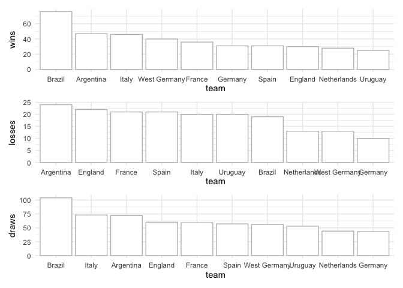
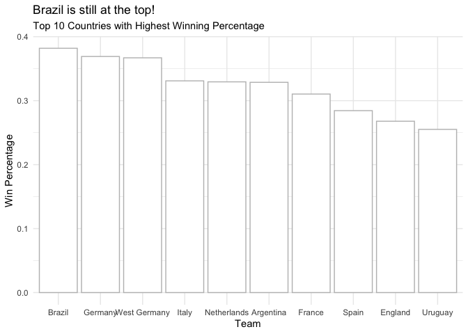

World Cup EDA
================

# Purpose

To deeper my understanding of R I want to try my hand at exploring
different data sets in which I can apply my newly learned skills.

For this notebook, I’ll look at the [FIFA world cup
dataset](https://github.com/rfordatascience/tidytuesday/tree/master/data/2022/2022-11-29)
⚽️ from the Tidy Tuesdays

------------------------------------------------------------------------

## Prep

First, let’s load the libraries and data:

``` r
library(tidyverse)
library(ggplot2)
library(tidytuesdayR) # library from which we'll retrieve the data
library(patchwork)
library(stringr)

# Let's also set a theme for our plots
theme_set(theme_minimal())
```

There are two dataframes that we’ll index to two separate dataframe
objects

``` r
world_cup <- tt_load('2022-11-29')
```

    ## 
    ##  Downloading file 1 of 2: `wcmatches.csv`
    ##  Downloading file 2 of 2: `worldcups.csv`

``` r
wc_matches <- world_cup$wcmatches
wc_cups <- world_cup$worldcups
```

## Data Review

Let’s now take a quick look at both dataframes and see if they match
expectations

``` r
head(wc_matches)
```

    ## # A tibble: 6 × 15
    ##    year country city       stage home_…¹ away_…² home_…³ away_…⁴ outcome win_c…⁵
    ##   <dbl> <chr>   <chr>      <chr> <chr>   <chr>     <dbl>   <dbl> <chr>   <chr>  
    ## 1  1930 Uruguay Montevideo Grou… France  Mexico        4       1 H       <NA>   
    ## 2  1930 Uruguay Montevideo Grou… Belgium United…       0       3 A       <NA>   
    ## 3  1930 Uruguay Montevideo Grou… Brazil  Yugosl…       1       2 A       <NA>   
    ## 4  1930 Uruguay Montevideo Grou… Peru    Romania       1       3 A       <NA>   
    ## 5  1930 Uruguay Montevideo Grou… Argent… France        1       0 H       <NA>   
    ## 6  1930 Uruguay Montevideo Grou… Chile   Mexico        3       0 H       <NA>   
    ## # … with 5 more variables: winning_team <chr>, losing_team <chr>, date <date>,
    ## #   month <chr>, dayofweek <chr>, and abbreviated variable names ¹​home_team,
    ## #   ²​away_team, ³​home_score, ⁴​away_score, ⁵​win_conditions

``` r
head(wc_cups)
```

    ## # A tibble: 6 × 10
    ##    year host        winner       second third fourth goals…¹ teams games atten…²
    ##   <dbl> <chr>       <chr>        <chr>  <chr> <chr>    <dbl> <dbl> <dbl>   <dbl>
    ## 1  1930 Uruguay     Uruguay      Argen… USA   Yugos…      70    13    18  434000
    ## 2  1934 Italy       Italy        Czech… Germ… Austr…      70    16    17  395000
    ## 3  1938 France      Italy        Hunga… Braz… Sweden      84    15    18  483000
    ## 4  1950 Brazil      Uruguay      Brazil Swed… Spain       88    13    22 1337000
    ## 5  1954 Switzerland West Germany Hunga… Aust… Urugu…     140    16    26  943000
    ## 6  1958 Sweden      Brazil       Sweden Fran… West …     126    16    35  868000
    ## # … with abbreviated variable names ¹​goals_scored, ²​attendance

Furthermore, let’s see if there is any empty data that we have to deal
with:

``` r
sum(is.na(wc_cups))
```

    ## [1] 0

``` r
sum(is.na(wc_matches))
```

    ## [1] 1176

The `wc_matches` seems to have several missing values, let’s review
which columns contribute the most to that number

``` r
sapply(wc_matches, function(x) sum(is.na(x)))
```

    ##           year        country           city          stage      home_team 
    ##              0              0              0              0              0 
    ##      away_team     home_score     away_score        outcome win_conditions 
    ##              0              0              0              0            838 
    ##   winning_team    losing_team           date          month      dayofweek 
    ##            169            169              0              0              0

There are three columns that compose all the missing values, let’s index
those and take a sample from each of those columns

``` r
wc_matches %>%
  filter(!is.na(win_conditions)) %>%
  select(win_conditions) %>%
  head()
```

    ## # A tibble: 6 × 1
    ##   win_conditions           
    ##   <chr>                    
    ## 1 Austria won in AET       
    ## 2 Italy won in AET         
    ## 3 Brazil won in AET        
    ## 4 Czechoslovakia won in AET
    ## 5 Italy won in AET         
    ## 6 Hungary won in AET

``` r
wc_matches %>%
  filter(is.na(winning_team)) %>%
  select(outcome, winning_team, losing_team) %>%
  head()
```

    ## # A tibble: 6 × 3
    ##   outcome winning_team losing_team
    ##   <chr>   <chr>        <chr>      
    ## 1 D       <NA>         <NA>       
    ## 2 D       <NA>         <NA>       
    ## 3 D       <NA>         <NA>       
    ## 4 D       <NA>         <NA>       
    ## 5 D       <NA>         <NA>       
    ## 6 D       <NA>         <NA>

After reviewing this data we learned two important things:

1.  `NA` values in `win_conditions` occur when the game was either won,
    lost, or drawn in regular time. Whenever this column is not empty,
    it means that the game was decided in extra time (`AET`) or in
    penalties
2.  The `winning_team` and `losing_team` both have the same amount of
    missing values. This should’ve been an indicator that `NA` values
    here represent draws.

Consequently, let’s take the following action:

> Create a new column called `penalties` and a new column called `aet`.
> These two columns will help to better characterize the results of the
> game

``` r
# This will only set the values to those columns that have a value for 
# win_conditions
wc_matches <- wc_matches %>%
  mutate(penalties = ifelse(str_detect(win_conditions, 'penalties'), 1, 0),
         aet = ifelse(!is.na(win_conditions), 1, 0))

# Set all the NA values in the two columns to zero
wc_matches[c("penalties", "aet")][is.na(wc_matches[c("penalties", "aet")])] <- 0

wc_matches
```

    ## # A tibble: 900 × 17
    ##     year country city      stage home_…¹ away_…² home_…³ away_…⁴ outcome win_c…⁵
    ##    <dbl> <chr>   <chr>     <chr> <chr>   <chr>     <dbl>   <dbl> <chr>   <chr>  
    ##  1  1930 Uruguay Montevid… Grou… France  Mexico        4       1 H       <NA>   
    ##  2  1930 Uruguay Montevid… Grou… Belgium United…       0       3 A       <NA>   
    ##  3  1930 Uruguay Montevid… Grou… Brazil  Yugosl…       1       2 A       <NA>   
    ##  4  1930 Uruguay Montevid… Grou… Peru    Romania       1       3 A       <NA>   
    ##  5  1930 Uruguay Montevid… Grou… Argent… France        1       0 H       <NA>   
    ##  6  1930 Uruguay Montevid… Grou… Chile   Mexico        3       0 H       <NA>   
    ##  7  1930 Uruguay Montevid… Grou… Bolivia Yugosl…       0       4 A       <NA>   
    ##  8  1930 Uruguay Montevid… Grou… Paragu… United…       0       3 A       <NA>   
    ##  9  1930 Uruguay Montevid… Grou… Uruguay Peru          1       0 H       <NA>   
    ## 10  1930 Uruguay Montevid… Grou… Argent… Mexico        6       3 H       <NA>   
    ## # … with 890 more rows, 7 more variables: winning_team <chr>,
    ## #   losing_team <chr>, date <date>, month <chr>, dayofweek <chr>,
    ## #   penalties <dbl>, aet <dbl>, and abbreviated variable names ¹​home_team,
    ## #   ²​away_team, ³​home_score, ⁴​away_score, ⁵​win_conditions

## EDA - World Cup Matches

Seeing as we’ve done most of the work on the `wc_matches` dataframe,
we’ll take a first swing at further investigating this data.

However, before we begin, let’s ask some questions that will help to
guide our analysis:

1.  Who is the winningest/losingest/drawingest (not sure if that’s a
    word) team? - Review both raw wins and win %
2.  What team has played the most games in the WC? Is that associated
    with the having more wins? One would think yes
3.  What team has scored the most goals and has had the most goals
    scored against them?
4.  How many matches have required extra time? If so, how many have
    required penalties?
5.  Do scores vary across dates? Meaning do we see more
    wins/losses/draws on a certain day of the week?
6.  Does being home or away have any impact on the outcome of the game?
7.  Do we see a difference in the amount of goals scored year to year?

For now, I think that list of questions should be enough to get us
started : )

### 1. & 2. Winningest/Losingest/?Drawingest? Teams and Most Games

#### 1. Winningest/Losingest/?Drawingest? Teams

``` r
# Grouping the wins
wc_wins <- wc_matches %>%
  filter(!is.na(winning_team)) %>%
  group_by(winning_team) %>%
  summarize(wins=n()) %>%
  arrange(desc(wins)) %>%
  rename(team = winning_team)

# Grouping the losses
wc_losses <- wc_matches %>%
  filter(!is.na(losing_team)) %>%
  group_by(losing_team) %>%
  summarize(losses=n()) %>%
  arrange(desc(losses)) %>%
  rename(team = losing_team)

# Grouping the draws by home and away
wc_draws_home <- wc_matches %>%
  filter(is.na(win_conditions)) %>%
  group_by(home_team) %>%
  summarize(draws_home=n()) %>%
  arrange(desc(draws_home)) %>%
  rename(team = home_team)

wc_draws_away <- wc_matches %>%
  filter(is.na(win_conditions)) %>%
  group_by(away_team) %>%
  summarize(draws_away=n()) %>%
  arrange(desc(draws_away)) %>%
  rename(team = away_team)

# We then have to merge the two draws and add the results:
wc_draws <- inner_join(x = wc_draws_home, y = wc_draws_away)
wc_draws$draws <- wc_draws$draws_away + wc_draws$draws_home
wc_draws <- wc_draws[c("team", "draws")]

# We can then merge all the objects together
wc_results <- inner_join(wc_wins, wc_losses)
wc_results <- inner_join(wc_results, wc_draws)

# Then create a final column which adds up all the games played
wc_results$games <- rowSums(wc_results[c("wins", "losses", "draws")])
```

Now, we can go ahead and begin to visualize the different results from
our games

``` r
par(mfrow=c(3,1))

graph_results <- function(df, x, y) {
  x = enquo(arg = x)
  y = enquo(arg = y)
  
  result_graph <- df %>%
    head(10) %>%
    ggplot() + 
    aes(x=reorder(!!x, -!!y), y=!!y) + 
    geom_bar(
      stat = 'identity',
      color = 'gray',
      fill = 'white') + 
    labs(
      x = x,
      y = y
    )
  
  return(result_graph)
}

wins <- graph_results(wc_results, team, wins)
losses <- graph_results(wc_results, team, losses)
draws <- graph_results(wc_results, team, draws)

wins / losses / draws
```

<!-- -->

Brazil is the winningest and drawingest team?, Argentina is the
losingest team. However, if we take a look at winning percentage, do we
still see a similar arrangement?

``` r
wc_results$win_pct <- wc_results$wins / wc_results$games

wc_results %>% 
  head(10) %>%
  ggplot() + 
  aes(x = reorder(team, -win_pct), y = win_pct) + 
  geom_bar(
    stat = 'identity',
    color = 'gray',
    fill = 'white') + 
  labs(title = 'Brazil is still at the top!',
       subtitle = 'Top 10 Countries with Highest Winning Percentage',
       x='Team',
       y='Win Percentage')
```

<!-- -->

There is the topic of `Germany` and `West Germany` which I have ignored.
Should we count these two together or leave them separate? For now, I’ll
leave them be.

#### 2. Most Games Played

With the data already structure, it’s quite easy to determine the team
with the most games by calling the `games` column in the `wc_results`.

So let’s grab those results and also plot them agains the `wins` column
to see if there is any evident trend between games played and wins:

``` r
# Getting the top-5 countries with the most games played
wc_results %>%
  arrange(desc(games)) %>%
  head(5) %>%
  print()
```

    ## # A tibble: 5 × 6
    ##   team       wins losses draws games win_pct
    ##   <chr>     <int>  <int> <int> <dbl>   <dbl>
    ## 1 Brazil       76     19   104   199   0.382
    ## 2 Argentina    47     24    72   143   0.329
    ## 3 Italy        46     20    73   139   0.331
    ## 4 France       36     21    59   116   0.310
    ## 5 England      30     22    60   112   0.268

``` r
# Plotting the games played vs wins
wc_results %>%
  ggplot() + 
  aes(x=wins, y=games) +
  geom_point(shape=1) + 
  labs(title = 'More games = More wins',
       x = 'Number of Wins',
       y = 'Number of Games Played')
```

<!-- -->

From the scatterplot, we can clearly see that the more games a team has
played, the more games they’ve won. This makes sense as if you get pass
the group stages of the world cup, you will get to play more games as
you win.

### 3. What team has scored the most goals?

``` r
# Function to group the teams by home/away and home/away goals
wc_goals_fx <- function(df, group, col){
  group = enquo(arg = group)
  col = enquo(arg = col)
  
  wc_goal_type <- df %>%
    group_by(!!group) %>%
    summarize(sum(!!col)) %>%
    rename(team = !!group)
  
  return(wc_goal_type)
}

# Goals Scored For and Against, Home and Away
goals_home_sco <- wc_goals_fx(wc_matches, home_team, home_score)
goals_away_sco <- wc_goals_fx(wc_matches, away_team, away_score)
goals_home_con <- wc_goals_fx(wc_matches, home_team, away_score)
goals_away_con <- wc_goals_fx(wc_matches, away_team, home_score)

# Goals Scored
goals_scored <- inner_join(goals_home_sco, goals_away_sco)
```

    ## Joining, by = "team"

``` r
goals_scored$total_goals_scored <- goals_scored$`sum(home_score)` + goals_scored$`sum(away_score)`
goals_scored <- goals_scored[c('team', 'total_goals_scored')]

# Goals Conceded
goals_conceded <- inner_join(goals_home_con, goals_away_con)
```

    ## Joining, by = "team"

``` r
goals_conceded$total_goals_conceded <- goals_conceded$`sum(home_score)` + goals_conceded$`sum(away_score)`
goals_conceded <- goals_conceded[c('team', 'total_goals_conceded')]

# Join the two and clean up the dataframe
goals <- inner_join(x = goals_scored, y = goals_conceded)
```

    ## Joining, by = "team"

``` r
goals$differential <- goals$total_goals_scored - goals$total_goals_conceded
goals <- rename(
  goals, 
  scored = total_goals_scored, 
  conceded = total_goals_conceded
)

# Let's do a quick scatterplot
scored_v_conceded <- goals %>%
  ggplot() + 
  aes(x = conceded, y = scored) +
  geom_point(shape = 1) + 
  labs(title = "More Goals Scored Means More Goals Conceded",
       x = "Goals Conceded",
       y = "Goals Scored")

# Additionally, let's look at the distribution of goal differentials:
goal_differential <- goals %>% 
  ggplot() + 
  aes(x=differential) + 
  geom_histogram(
    binwidth=5,
    color="gray",
    fill="white") + 
  geom_vline(
    xintercept=mean(goals$differential),
    linetype="dashed",
    color="red") + 
  labs(
    title = "Mostly Normal Distribution and Brazil...",
    subtitle = "Average (Red Line) Differential is Zero",
    x = "Goal Differential",
    y = "Count")

scored_v_conceded / goal_differential
```

<!-- -->

### 4. How many matches have required extra time? If so, how many have required penalties?

Answering this question is a bit tricky. Unfortunately, since we do not
know which games were group stage games vs. knock-out games, we cannot
get an accurate percentage of extra time games out of the ones that were
eligible for it (only knockout games can have extra time/penalties).

``` r
# Extra time matches
aet <- wc_matches %>%
  group_by(aet) %>%
  summarize(count_aet = n()) %>%
  arrange(desc(aet)) %>%
  rename(
    'Extra Time Required' = aet,
    'Count' = count_aet
  )

# Penalty matches
penalties <- wc_matches %>%
  group_by(penalties) %>%
  summarize(count_penalties = n()) %>%
  arrange(desc(penalties)) %>%
  rename(
    'Penalties Required' = penalties,
    'Count' = count_penalties
  )

# Percentages
count_aet <- aet[aet$`Extra Time Required` == 1, ]$Count
pct_aet <- count_aet / length(wc_matches)
count_penalties <- penalties[penalties$`Penalties Required` == 1, ]$Count
pct_penalties <- count_penalties / length(wc_matches)

cat('Percentage of matches requiring Extra Time:', round(pct_aet, 2), '%',
    '(', count_aet, ')\n')
```

    ## Percentage of matches requiring Extra Time: 3.65 % ( 62 )

``` r
cat('Percentage of matches requiring Penalties:', round(pct_penalties, 2), '%',
    '(', count_penalties, ')')
```

    ## Percentage of matches requiring Penalties: 1.76 % ( 30 )

So in total, less than 5% of games have gone into extra time/penalties.
If we could extract the number of games eligible for extra time
(knockouts), we could attain a more accurate percentage, but for now
this’ll do.

### 5. Do scores vary across days of the week?

This is quite a simple question to answer since we can simply group
together the days of the week and total the number of goals for both
home and away teams… so let’s do it!

``` r
# Re-order the days of wek
wc_matches$dayofweek <- factor(wc_matches$dayofweek, levels = c("Monday", "Tuesday", "Wednesday", "Thursday", "Friday", "Saturday", "Sunday"))

# Grouping operation to get the total number of goals and games 
wc_goals_by_day <- wc_matches %>%
  group_by(dayofweek) %>%
  summarize(
    count_games = n(),
    goals_away = sum(away_score),
    goals_home = sum(home_score)
  ) %>%
  mutate(
    goals = goals_away + goals_home,
    goals_per_game = goals / count_games) %>%
  select(
    dayofweek,
    count_games,
    goals, 
    goals_per_game
  )

# Apply and view ordering
wc_goals_by_day <- wc_goals_by_day[order(wc_goals_by_day$dayofweek), ]
wc_goals_by_day
```

    ## # A tibble: 7 × 4
    ##   dayofweek count_games goals goals_per_game
    ##   <fct>           <int> <dbl>          <dbl>
    ## 1 Monday             82   209           2.55
    ## 2 Tuesday           119   321           2.70
    ## 3 Wednesday         148   417           2.82
    ## 4 Thursday          111   289           2.60
    ## 5 Friday             92   214           2.33
    ## 6 Saturday          152   426           2.80
    ## 7 Sunday            196   672           3.43

From the grouped table above, we cna see that `Sunday` is the best day
if you want to see a high-scoring match. Let’s visualize this data as
well without having to group this data.

``` r
wc_matches %>%
  mutate(
    total_goals = away_score + home_score
  ) %>%
  ggplot() +
  aes(x=dayofweek, y=total_goals) + 
  geom_boxplot() + 
  labs(
    title = "Weekends have the most action!",
    x = "Day of Week",
    y = "Goals"
  )
```

<!-- -->

If you want to see a high-scoring game, you are most likely to see that
on the weekend. However, the next best option seems to be hump day!

### 6. Does being home or away have any impact on the outcome of the game?

This again, is quite a simple operation that we can accomplish with a
quick grouping operation:

``` r
wc_matches %>%
  group_by(outcome) %>%
  summarize(wins = n())
```

    ## # A tibble: 3 × 2
    ##   outcome  wins
    ##   <chr>   <int>
    ## 1 A         302
    ## 2 D         169
    ## 3 H         429

So, there is a slight home-field advantage, but again nothing
significant here. Again, `home` and `away` really doesn’t have much
significance in the world cup since you are typically not playing at
your real `home`.

### 7. Do we see a difference in the amount of goals scored year to year?

This is quite a fun statistic. What world cup was the highest scoring
one and which one had the highest goals per game?

``` r
wc_goals_by_year <-wc_matches %>%
  group_by(year) %>%
  summarize(
    games = n(),
    goals_away = sum(away_score),
    goals_home = sum(home_score)
  ) %>%
  mutate(
    goals = goals_away + goals_home,
    goals_per_game = goals / games
  ) %>%
  select(
    year,
    games,
    goals,
    goals_per_game
  )

goals_games_by_year <- wc_goals_by_year %>%
  ggplot(aes(year)) + 
  geom_line(aes(y = goals, colour = "Goals")) + 
  geom_point(aes(y = goals, colour = "Goals")) + 
  geom_line(aes(y = games, colour = "Games")) + 
  geom_point(aes(y = games, colour = "Games")) + 
  labs(
    title = "A lot fewer games were played in the past",
    x = "Year",
    y = "Goals"
  )

goals_per_game_by_year <- wc_goals_by_year %>%
  ggplot() + 
  aes(x = year, y = goals_per_game) + 
  geom_bar(
    stat = "identity",
    fill = "white",
    color = "gray"
  ) + 
  labs(
    title = "1954 was a goal bonanza!",
    x = "Year",
    y = "Goals Per Year"
  )

goals_games_by_year / goals_per_game_by_year
```

<!-- -->

The most notable feature from above is the huge amount of goals that
were scored in the 1954 world cup. An average of roughly 5 goals were
scored a game! Obviously, we have to consider that there were much fewer
matches played but one cannot deny that it was definitely a world cup
worth watching!
